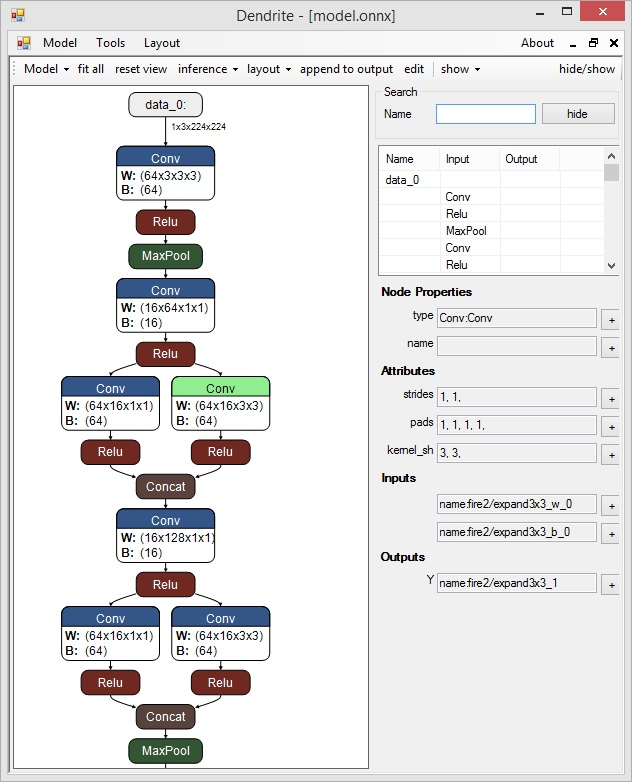
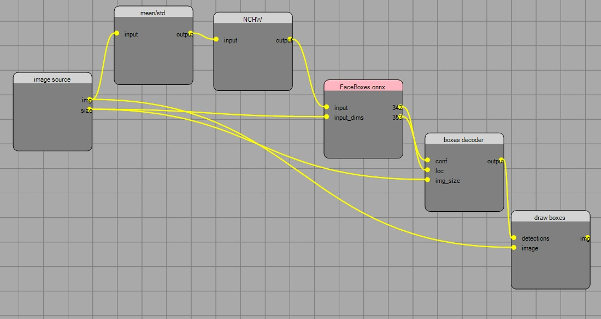

# Dendrite
ONNX viewer &amp; editor

Graph layout https://github.com/fel88/Dagre.NET

**Project status: WIP**

## How to create an inference environment:

1. Open graph editor  (Model->Inference->Manager)
2. Add Net node and select .onnx file to use
3. Add pre/post-processing nodes (e.g NCHW, Mean/Std normalization, boxes decoder ... etc.)
4. Load sample image to Image Source Node (Context menu -> Load image)
5. Run inference
6. Check outputs
7. (optional). Save inference environment to .den file for quick use next time

Ready inference environments can be downloaded from here : https://github.com/fel88/Dendrite.Environments
